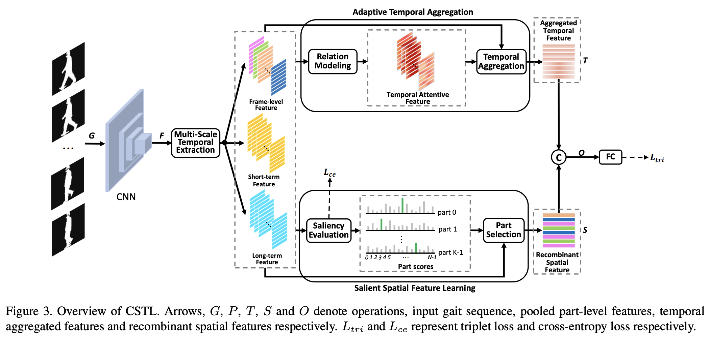
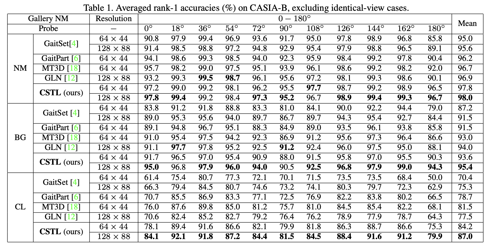
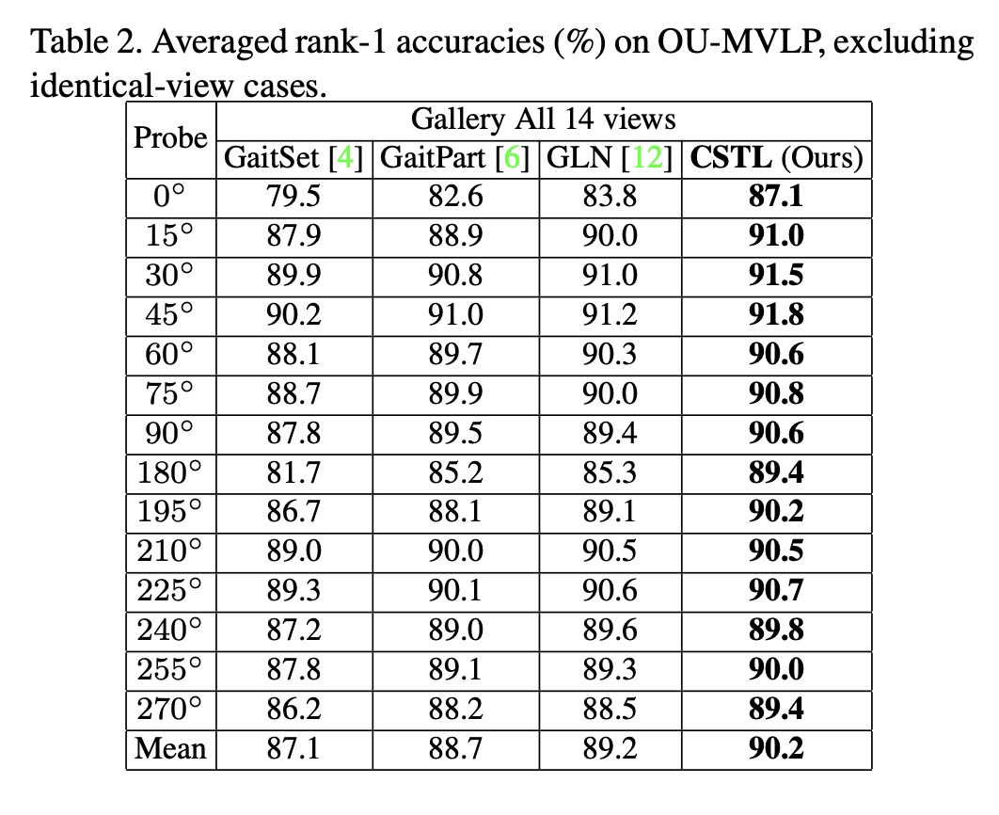

# Context-Sensitive-Temporal-Feature-Learning-for-Gait-Recognition
ICCV 2021 PAPER is available at <a href="https://openaccess.thecvf.com/content/ICCV2021/html/Huang_Context-Sensitive_Temporal_Feature_Learning_for_Gait_Recognition_ICCV_2021_paper.html" title="CSTL">Context-Sensitive-Temporal-Feature-Learning-for-Gait-Recognition</a>.

## Abstract
Although gait recognition has drawn increasing research attention recently, it remains challenging to learn discriminative temporal representation since the silhouette differences are quite subtle in spatial domain. Inspired by the observation that humans can distinguish gaits of different subjects by adaptively focusing on temporal sequences with different time scales, we propose a context-sensitive temporal feature learning (CSTL) network in this paper, which aggregates temporal features in three scales to obtain motion representation according to the temporal contextual information. Specifically, CSTL introduces relation modeling among multi-scale features to evaluate feature importances, based on which network adaptively enhances more important scale and suppresses less important scale. Besides that, we propose a salient spatial feature learning (SSFL) module to tackle the misalignment problem caused by temporal operation, e.g., temporal convolution. SSFL recombines a frame of salient spatial features by extracting the most discriminative parts across the whole sequence. In this way, we achieve adaptive temporal learning and salient spatial mining simultaneously. Extensive experiments conducted on two datasets demonstrate the state-of-the-art performance. On CASIA-B dataset, we achieve rank-1 accuracies of 98.0%, 95.4% and 87.0% under normal walking, bag-carrying and coat-wearing conditions. On OU-MVLP dataset, we achieve rank-1 accuracy of 90.2%.

## Framework
<div align=center></div>

## Result
<div align=center></div>
<div align=center></div>

## Note
Due to the 64 x 44 silhouettes are in a low resolution, the experiment results will oscillate from time to time. Therefore, we highly recommend you guys to conduct experiments with 128 x 88 resolution on CASIA-B dataset, which produces relatively stable results.

## Usage
The dataset path can be set in config.py.

Train command: 
```
python train.py
```

Inference command:
```
python test.py
```
## Citation
Citation Format:
```
@inproceedings{huang2021context, 
  title={Context-Sensitive Temporal Feature Learning for Gait Recognition}, 
  author={Huang, Xiaohu and Zhu, Duowang and Wang, Hao and Wang, Xinggang and Yang, Bo and He, Botao and Liu, Wenyu and Feng, Bin},
  booktitle={Proceedings of the IEEE/CVF International Conference on Computer Vision},
  pages={12909--12918},
  year={2021}
}
```
